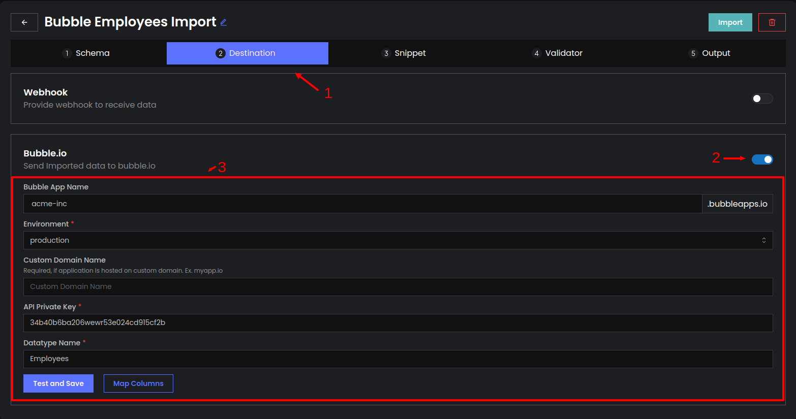

# FAQs

## How to get TemplateId, ProjectId, and Access Token?

1. Open the Import description and go to the Snippet portion of the Import.
2. Open the last item of the accordion, where you will find necessary keys.

<figure><figcaption>
Steps to get ProjectId, TemplateId and AccessToken for the Import
</figcaption></figure>

Still, have any doubts? Shoot us a message directly on [Discord](https://discord.impler.io).
