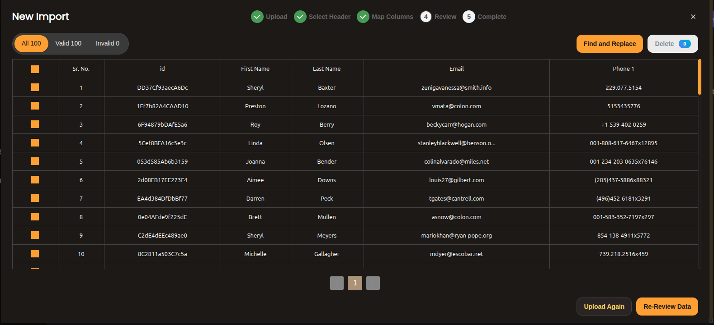
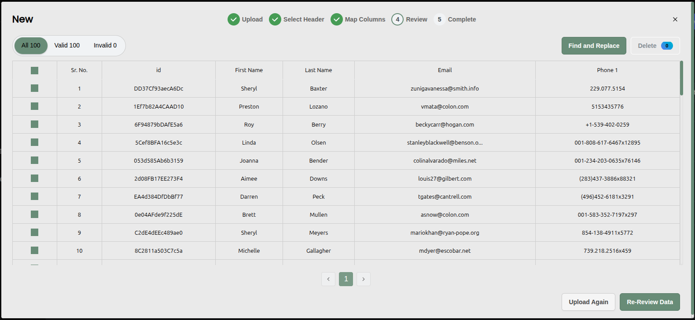

# Customizing Widget Appearance

You can customize the visual appearance of the Impler widget to better match the look and feel of your application. This is achieved by passing an appearance configuration object when initializing the widget (e.g., within the useImpler hook).

## The AppearanceConfig Object

The core of customization lies in the AppearanceConfig object. You pass this object to the appearance property during widget initialization.

```json
// Example using useImpler hook (React)
const { showWidget } = useImpler({
  projectId: 'YOUR_PROJECT_ID',
  templateId: 'YOUR_TEMPLATE_ID', // Or template name
  // ... other required props
  appearance: {
    // Customization properties go here
    primaryColor: '#FF5733', // Example primary color
    fontFamily: '"Segoe UI", Tahoma, Geneva, Verdana, sans-serif', // Example font stack
    borderRadius: '8px', // Example border radius
    widget: {
      backgroundColor: '#FAFAFA' // Example widget background
    },
    primaryButtonConfig: {
       backgroundColor: '#FF5733',
       textColor: '#FFFFFF',
       hoverBackground: '#E64A19'
    },
    secondaryButtonConfig: {
       borderColor: '#CCCCCC',
       textColor: '#555555',
       hoverBackground: '#EEEEEE'
    }
  }
});
```


**All customization options are optional.** You only need to include the properties you wish to override from the default theme. If the appearance object itself is not provided, the widget will use its default styling.


### Available AppearanceConfig Properties:

<table><thead><tr><th>Property</th><th>Type</th><th width="446">Usage</th></tr></thead><tbody><tr><td><code>primaryColor</code></td><td>string (Depricated)</td><td>Sets the main theme color used for accents, highlights, and often the default primary button background.</td></tr><tr><td><code>fontFamily</code></td><td>string</td><td>Specifies the font family for the text within the widget. Use standard CSS font-family values (e.g., 'Inter', sans-serif, 'Arial', Helvetica, sans-serif).</td></tr><tr><td><code>borderRadius</code></td><td>string</td><td>Controls the roundness of corners for elements like the main widget container and buttons. Use standard CSS border-radius values (e.g., '4px', '10px', '0.5rem').</td></tr><tr><td><code>widget</code></td><td>object</td><td><p></p><p>Contains properties to style the main widget container.</p><ul><li><code>backgroundColor</code> (string, optional): Sets the background color of the main widget area.</li></ul></td></tr><tr><td><code>primaryButtonConfig</code></td><td>ButtonConfig</td><td>An object to customize the appearance of primary action buttons (e.g., "Import", "Continue"). See ButtonConfig details below.</td></tr><tr><td><code>secondaryButtonConfig</code></td><td>ButtonConfig</td><td>An object to customize the appearance of secondary action buttons (e.g., "Cancel", "Back"). See ButtonConfig details below.</td></tr></tbody></table>

### **The ButtonConfig Object**

Both `primaryButtonConfig` and `secondaryButtonConfig` accept a **ButtonConfig** object with the following optional properties to style buttons:

<table><thead><tr><th>Property</th><th width="154.800048828125">Type</th><th width="357.199951171875">Usage</th></tr></thead><tbody><tr><td><code>backgroundColor</code></td><td>string</td><td>The background color of the button in its normal state.</td></tr><tr><td><code>textColor</code></td><td>string</td><td>The text color of the button in its normal state.</td></tr><tr><td><code>borderColor</code></td><td>string</td><td>The border color of the button in its normal state.</td></tr><tr><td><code>hoverBackground</code></td><td>string</td><td>The background color when the mouse hovers over the button.</td></tr><tr><td><code>hoverTextColor</code></td><td>string</td><td>The text color when the mouse hovers over the button.</td></tr><tr><td><code>hoverBorderColor</code></td><td>string</td><td>The border color when the mouse hovers over the button.</td></tr><tr><td><code>buttonShadow</code></td><td>string</td><td>Adds a CSS box-shadow to the button (e.g., '0 2px 4px rgba(0,0,0,0.1)').</td></tr></tbody></table>

### **Reference: Type Definitions**

For clarity, here are the TypeScript type definitions:

```typescript
export declare type AppearanceConfig = {
  widget?: {
    backgroundColor?: string;
  };
  primaryColor?: string; // Consider deprecation, prefer setting inside buttons/elements
  fontFamily?: string;
  borderRadius?: string;
  primaryButtonConfig?: ButtonConfig;
  secondaryButtonConfig?: ButtonConfig;
};

export type ButtonConfig = {
  backgroundColor?: string;
  buttonShadow?: string;
  textColor?: string;
  hoverBackground?: string;
  hoverBorderColor?: string;
  borderColor?: string;
  hoverTextColor?: string;
};
```

### &#x20;Widget Customization Examples

You can transform the Impler widget's appearance significantly using the `appearance` object. Below are a few styled examples showing how you might customize it to match your brand or product design.

```typescript
const { showWidget } = useImpler({
  projectId: 'YOUR_PROJECT_ID',
  templateId: 'YOUR_TEMPLATE_ID',
   appearance: {
      widget: {
        backgroundColor: '#1c1917',
      },
      fontFamily: 'Inter, sans-serif',
      borderRadius: '12px',
      primaryButtonConfig: {
        backgroundColor: '#f59e0b',
        textColor: '#1c1917',
        hoverBackground: '#fbbf24',
        hoverTextColor: '#1c1917',
        borderColor: 'transparent',
        hoverBorderColor: 'transparent',
        buttonShadow: '0 4px 16px rgba(245, 158, 11, 0.4)',
      },
      secondaryButtonConfig: {
        backgroundColor: '#292524',
        textColor: '#fcd34d',
        hoverBackground: '#3c2d2a',
        hoverTextColor: '#fed7aa',
        borderColor: '#44403c',
        hoverBorderColor: '#f59e0b',
        buttonShadow: 'none',
      },
    },
});

```

<figure><figcaption><p>Dark Themed Widget </p></figcaption></figure>

```typescript
  const { showWidget } = useImpler({
  projectId: 'YOUR_PROJECT_ID',
  templateId: 'YOUR_TEMPLATE_ID',
  appearance: {
    widget: {
      backgroundColor: '#eaeaea',
      background: '#eaeaea',
      border: '1px solid #d5d5d5',
      boxShadow: '0 1px 4px rgba(0, 0, 0, 0.02)',
    },
    primaryColor: '#6d8c76', // darker sage — earthy, elegant
    fontFamily: '"Inter", "Segoe UI", sans-serif',
    borderRadius: '6px',
    primaryButtonConfig: {
      backgroundColor: '#6d8c76',
      textColor: '#ffffff',
      hoverBackground: '#5e7c67',
      hoverTextColor: '#ffffff',
      borderColor: '#5b7864',
      hoverBorderColor: '#496354',
      buttonShadow: '0 2px 6px rgba(109, 140, 118, 0.25)',
    },
    secondaryButtonConfig: {
      backgroundColor: '#f5f5f5',
      textColor: '#4a4a4a',
      hoverBackground: '#e5e5e5',
      hoverTextColor: '#2f2f2f',
      borderColor: '#cccccc',
      hoverBorderColor: '#b3b3b3',
      buttonShadow: '0 1px 3px rgba(0, 0, 0, 0.03)',
     },
    }, 
});

```

<figure><figcaption></figcaption></figure>


By utilizing the appearance object and its nested configurations, you can effectively theme the Impler widget to integrate visually with your application. Remember that all properties are optional, allowing you to customize as much or as little as needed.



